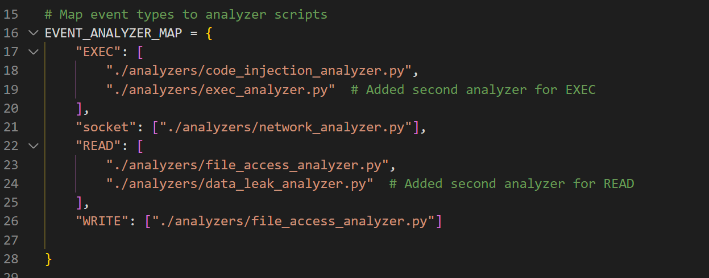
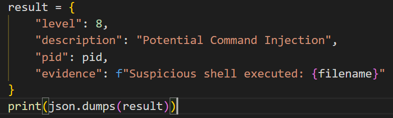

首先，你需要在wrapper的这个部分，把你的文件名和你需要检测的事件名称（event）匹配在一起。你不需要在系统内再抓取，wrapper会自动把相应的json输送到你的wrapper里，你只需要`for line in sys.stdin:`读取进来就行

他是会自动读取当前路径下analyzer文件夹中的所有py文件，作为子进程执行。

上图是result的格式，关于这个level，你可以参考cvss对你发现的漏洞进行打分。

https://en.wikipedia.org/wiki/Common_Vulnerability_Scoring_System#Version_4.0

根据这个网站的要求，返回一个cvss评分，当作level传入。

