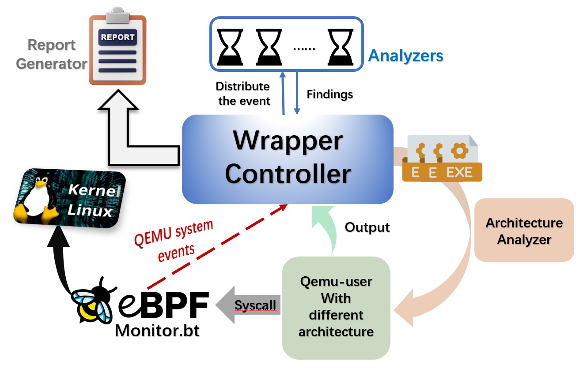

# Welcome to **qemu-guardian** 🛡️

**qemu-guardian** is a powerful and easy-to-use security analysis toolkit for Linux executables across multiple CPU architectures. With qemu-guardian, you can quickly analyze, monitor, and assess the security risks of untrusted binaries—even if they are compiled for platforms different from your host. 🚀

## What Can qemu-guardian Do? 🤔

- **Multi-Architecture Analysis** 
   Seamlessly supports x86, ARM, MIPS, PowerPC, RISC-V, and more—automatically detecting and running each executable with the right QEMU emulator.
- **Real-Time System Call Monitoring** 
   Uses eBPF/BPFTrace to capture and analyze system call activity for each target, giving you deep behavioral insight.
- **Modular Vulnerability Detection** 
   Detects a wide range of vulnerabilities (code injection, privilege escalation, memory corruption, etc.) using extensible Python-based analyzers.
- **Resource Isolation & Sandboxing** 
   Leverages Linux cgroup for strict resource control, keeping your system safe during analysis.
- **Batch and Automated Analysis** 
   Scan and analyze an entire directory of executables in one command—no manual setup needed.
- **Real-Time Reports** 
   View security findings instantly through a convenient GUI.

## Why Use qemu-guardian? 

Whether you’re a security researcher, reverse engineer, or developer, **qemu-guardian** makes it easy to identify risky behavior and vulnerabilities before running untrusted code on real hardware. Analyze cross-architecture malware, firmware, or any Linux binary safely and efficiently.

------

## Get Started 🚀

1. **Go to the `wrapper` directory in this repository.**
2. **Follow the instructions in the README to install dependencies and start analyzing your executables!**

Ready to make your analysis smarter and safer?
 **Download qemu-guardian and get started today!** ✨