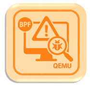
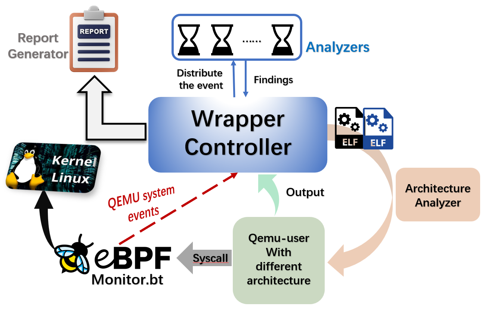

# Welcome to **Qemu-guardian** 🛡️

## Wrapper

The **Wrapper** leverage eBPF to monitor QEMU-user, then distribute the captured syscalls to the analyzers for analysis.

It is a powerful and easy-to-use security analysis toolkit for Linux executables across multiple CPU architectures. With qemu-guardian, you can quickly analyze, monitor, and assess the security risks of untrusted ELF binaries—even if they are compiled for platforms different from your host. 🚀

## What Can Wrapper Do? 🤔

- **Multi-Architecture Analysis** 
   Seamlessly supports x86, ARM, MIPS, PowerPC, RISC-V, and more—automatically detecting and running each executable with the right QEMU emulator.
- **Real-Time System Call Monitoring** 
   Uses eBPF/BPFTrace to capture and analyze system call activity for each target, giving you deep behavioral insight.
- **Modular Vulnerability Detection** 
   Detects a wide range of vulnerabilities (code injection, privilege escalation, memory corruption, etc.) using extensible Python-based analyzers.
- **Resource Isolation & Sandboxing** 
   Leverages Linux cgroup for strict resource control, keeping your system safe during analysis.
- **Batch and Automated Analysis** 
   Scan and analyze an entire directory of executables in one command—no manual setup needed.
- **Real-Time Reports** 
   View security findings instantly through a convenient GUI.

> **Note:** If you are interested in this project and would like to contribute, feel free to contact us or check the README in the [`wrapper`](./wrapper) folder.  
> We welcome your help in developing new analyzers!

## Further, We Have Released Guardian

**Guardian** 🛡️is a chrome plugin that can detect and isolate downloaded ELF files, upload them to a
server for wrapper analysis, and return the results.

Actually, we have put **Wrapper** in my server. It's just a very simple demo-version. However, you can try to use this plugins if you don't want to set up wrapper in your computer or you are Windows users. You can go to the `ChromeExtension` Folder to get more information. 

This plugin will automatically communicate with our sever, then give you the vulnerability reports of the ELF you uploaded.

> **Note:** Our current service is quite basic.  
> **Please do not attempt to attack our servers. Legal action will be taken against any malicious activity.**

## Why Use qemu-guardian?

* **Ease of Use**: A browser extension simplifies the workflow by automating download detection and
  environment setup, offering a plug-and-play experience.
* **Extensibility**: Features a plugin-based architecture where new analyzers can be easily added through simple configuration to expand detection coverage.
* **Lightweight**: The combination of QEMU-user and eBPF ensures minimal overhead, enabling fast
  execution and real-time responsiveness.
* **Cross-Architecture and even cross platform**: Supports multiple CPUarchitectures, allowing users to analyze programs for various platforms on a single hostGet. If you use the Chrome extension, you can also test ELF binaries with your Windows or Linux systems.  

## Started 🚀

1. **Go to the  [`wrapper`](./wrapper) directory in this repository.**
2. **Follow the instructions in the README to install dependencies and start analyzing your executables!**
3. **You can also go to [`ChromeExtension`](./ChromeExtension) directory to get a File Scan Interceptor and Guardian. It can detect the ELF download from your browser and send to out demo-Server automatically, then give you a vulnerability report.**

---

## In the end :)

This project was developed as part of the NUS Summer Workshop.  
Special thanks to our [Professor Hugh Anderson](https://smcnus.org/profile/hugh-anderson/) for his guidance and support.

✨ **Download Qemu-Guardian and get started today!**

 

---

**Licensed under the [Apache License 2.0](LICENSE).**
