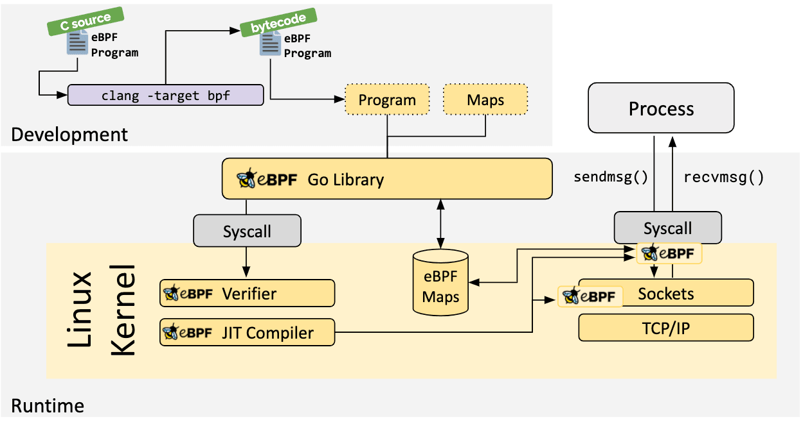

# Wrapper

**一个idea****：我们的在程序烧录到单片机之前，利用 QEMU-user** **和 eBPF** **进行模拟和监测，检测程序的合法性和安全性，从而弥补单片机本身无法 trace** **和调试的不足，大幅提升代码部署的可靠性和安全性。**

For certain RISC-V or … architecture programs that need to be flashed onto microcontrollers, traditional runtime tracing or debugging is often not feasible due to the hardware limitations of the microcontroller. Our project addresses this gap: by emulating the execution of these binaries using QEMU-user and monitoring system behavior with eBPF, we can effectively assess the correctness and potential security issues of the program before deployment. This approach allows developers to detect and mitigate problems in advance, ensuring that only safe and reliable code is deployed to resource-constrained devices.

**Key Advantages of Our Project (****我自己总结的你可以看看放在那里合适)**

1. Ease of Use:
        We have improved usability by developing a browser extension that     automatically detects download activities in the browser. This approach     greatly simplifies the user workflow. The system auto-configures the     required environment, resulting in a very low barrier to use.
2. Extensibility:
        Our analyzer adopts a plugin-based architecture. By simply adding a     configuration entry to a JSON file and placing the analyzer in the     appropriate folder, the wrapper automatically distributes relevant system     call events to the corresponding analyzers. As more plugins are added, the     system’s detection coverage becomes increasingly comprehensive.
3. Lightweight Operation:
        The system is highly lightweight. Both QEMU-user and eBPF introduce     minimal overhead, allowing for fast execution and a degree of real-time     responsiveness.
4. Cross-Platform Reusability:
        Our framework supports multiple CPU architectures. On a single host     machine, users can quickly inspect and test programs for various     architectures. This provides a rapid verification tool for debugging     software running on simple or embedded chips.
5. Sandboxing and Security:
        The system implements a basic sandboxing mechanism. For high-severity     vulnerabilities, it can automatically reclaim and terminate affected     processes, preventing further exploitation or system compromise.

​								figure 1.1

The wrapper consists of four main components. As illustrated in Figure 1.1, the overall workflow begins when the wrapper is launched. First, the Architecture Analyzer scans the executable files in the input directory. These files are then executed sequentially in QEMU-User. During execution, an eBPF-based monitoring script traces key system calls, such as `write`, `fork`, and `setuid`. The wrapper collects this syscall information and distributes the detected events in parallel to various analyzers, each designed to identify specific types of potential risks. Finally, all analysis results are aggregated by the report generator module, which produces a comprehensive vulnerability report for the user.

| x86     | **ARM**    | RISC-V    | MIPS    | Nios II |
| ------- | ---------- | --------- | ------- | ------- |
| PowerPC | OpenRISC   | LoongArch | S390x   | SPARC   |
| SPARCv9 | SuperH     | Alpha     | PA-RISC | m68k    |
| CRIS    | MicroBlaze | Xtensa    | Hexagon |         |

​							Supported Architectures  table-1.1

### eBPF monitor

### **Architecture Analyzer**

This module is designed to automatically identify the architecture of executable files within a given directory and map each file to the appropriate QEMU user-mode emulator. The analyzer first scans all files in the specified directory and checks whether they are valid ELF executables. For each executable, the module parses the ELF header to extract key architectural information, including bitness, endianness, and machine type. Based on these parameters, it selects the corresponding QEMU command from a predefined mapping table. The results give the recommended QEMU command to the wrapper.

eBPF monitor

**Wrapper Controller**

**1.** Monitoring Logic and Output Reading
 For each target executable, the system launches a BPFtrace monitoring script as an independent process. This monitor traces selected system calls during QEMU emulation. The wrapper continuously reads real-time JSON-formatted event data from the monitor’s standard output. To ensure correct parsing, it handles buffered output and brace-matching, and processes every complete JSON event as soon as it is available.

2. Cgroup-Based Resource Control

 For enhanced isolation and security, the system can optionally set up Linux control groups (cgroups), supporting both v1 and v2 backends. QEMU processes are launched inside their own dedicated cgroups, with strict resource limits (memory, CPU, process count). This enables safe termination of all processes in the cgroup if a high-risk event is detected.

3. Event Dispatch and Analyzer Plugins

 Each JSON event captured by the monitor is examined for its type. The wrapper maintains a mapping from event types to analyzer scripts. For each event, it locates the corresponding analyzers and invokes them in parallel using a thread pool. The event data is piped to the analyzers, which process the event and return structured results (including risk level, CVSS vector, and descriptions).

4. Report Generation

 After all the analyzers for an event have finished, the results are aggregated. If any analyzer detects a vulnerability above a predefined risk threshold, the system can automatically terminate suspicious processes using cgroup or process group controls. The final analysis and risk assessment are compiled into a comprehensive vulnerability report, which can be presented in a separate GUI report window.

### Report Generator

