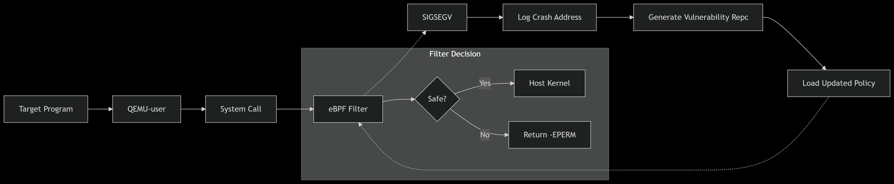

# Lightweight QEMU-user + BPF Sandbox Project Report

We aim to build a lightweight sandbox environment based on **QEMU-user** and **eBPF**, isolating target binaries for execution while providing real-time monitoring. It’s quick to deploy, has minimal overhead, and can record and intercept all suspicious behavior. This combination of QEMU-user’s lightweight sandboxing and eBPF’s powerful, in-kernel monitoring provides a versatile, low-impact platform for vulnerability validation and runtime defense.

------

## Core Technologies

- **QEMU-user**
  - **Cross-Platform**: Runs ARM, MIPS, PowerPC, etc. user-space ELF binaries on an x86 host.
  - **Easy Observation**: Wraps the target in a host-side process, isolating its loader and `libc` inside a clean minimal root.
- **eBPF**
  - **High Performance**: Runs in the kernel’s BPF VM, filtering and aggregating with almost zero overhead.
  - **High Fidelity**: Provides a “god-view” of any process’s syscalls, signals, network activity, memory allocations, etc., in real time from the host kernel.

> `QEMU-user` gives us a cross-platform, controlled “sandbox” environment;
>  `eBPF` sits outside it, observing the sandbox process with high efficiency and precision from the host kernel.
>  Together they deliver zero-intrusion, low-overhead, cross-platform isolation.

------

## Features

-  All guest syscalls execute in the host kernel.
- **Complete Visibility**
   Using eBPF tracepoints, kprobes, and uprobes to watch and **intercept** every syscall and unauthorized file or network access.
- **Real-Time Response**
   Dynamic alerts or in-kernel blocking of over-privileged calls (e.g. `open("/etc/shadow")`, `execve("/bin/sh")`).
- **Privilege Monitoring**
   eBPF can catch calls like `setuid` and `capset` to detect unauthorized privilege escalation attempts.
- **Process-Creation Monitoring**
   eBPF can track `fork` frequency to spot unusual process-spawn activity.
- In QEMU-user, guest socket calls (socket, connect, sendto, recvfrom, etc.) become ordinary host syscalls. You can use an eBPF script to trace these calls—logging their parameters, return values, counts or enforcing rate limits—but you only see the API-level data. To inspect raw packet contents, you’ll need a packet-capture solution.

------

## TODO

- **Write eBPF scripts** and attach them to the host kernel to:
  1. **Detect** all suspicious syscalls from the `qemu-x86_64` process.
  2. **Log** buffer overflows, illegal accesses, and privilege bypass attempts.
  3. **Block** any calls outside a defined whitelist to protect the host.

------

## Advantages & Innovations

1. **Minimal Overhead**
    QEMU-user + eBPF startup and runtime overhead is tiny—far lower than Pin or full TCG instrumentation—making it viable for long-term production use.
2. **Highly Reliable Isolation**
   - **Kernel-Level Integrity**: Monitoring runs entirely in the host kernel and cannot be tampered with by sandboxed code.
   - **Zero Side-Effects**: Sandbox resets in milliseconds; all filesystem access, environment variables, process table entries, and current working directory remain confined to the small QEMU-user root.
3. **Cross-Platform Reusability**
    The same eBPF scripts monitor any architecture’s user-space binary—ARM, MIPS, PowerPC, etc.—because all syscalls get translated through QEMU-user into the host’s tracepoints.
4. **In-Kernel Seccomp-Style Enforcement**
    Beyond passive monitoring, we can dynamically load or update seccomp-style BPF filters in the kernel—returning `EPERM` or triggering `SIGSYS`—to proactively block malicious calls in real time.

for example：

run qemu-user in qemu-x86. 

Problem I faced：

**Pure eBPF (tracepoint/kprobe)**

- **What**: Tap syscalls or kernel functions for observation.
- **+**: Zero production impact; full visibility; flexible logic.
- **–**: Read-only—cannot block or modify syscalls (aside from killing the process).

**seccomp-BPF (classic BPF)**

- **What**: Simple cBPF filter at syscall entry (allow or `EPERM`).
- **+**: Built-in, minimal overhead, works on any modern kernel.
- **–**: Very limited logic (only basic compare); static once installed.

**eBPF LSM (modern eBPF)**

- **What**: Attach full eBPF programs to LSM hooks (e.g. file_open).
- **+**: Rich C-level logic, can block/allow at security checkpoints.
- **–**: Requires `CONFIG_BPF_LSM`, a bit more setup/complexity.
